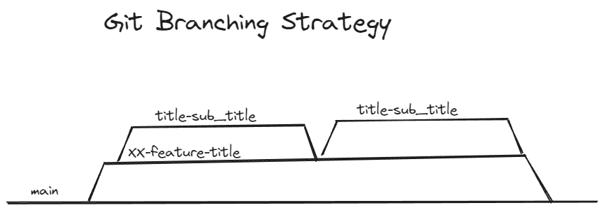

# Contribution Guidelines

This library is a wrapper library for the [Adafruit/NeoPixel](https://github.com/adafruit/Adafruit_NeoPixel). This library is an auxilary liibrary and is intended to be installed along with Adafruit's library, **not as an individual library**.

## Contributors 

There are broadly three different levels of contributors.

| Role | Description |
| ---- | ----------- |
| Core member | Code owner and reviewer |
| Volunteer | Directly affiliated code contributor |
| Open Source Contributor | Non-affiliated general contributor |

Core member and Volunteer roles are assigned internally at Code Wth Her. Open Source Contributors are for the general public.

## Contributing

All contributors are invited to submit issues for the following:
- Bugs
- Feature Requests
- Discussion

## Contributing pull requests

When contributing to the repo, please insure that:
- The PR resolves at least one existing/documented issue
    - Include issue number by linking the `#XXX` in the description
- Write small PRs that handle specific topics
- Format commit messages with readability in mind
    - Start with an action verb like "Fix" or "Add"

## Git Branching Strategy

We incorporate a modified [GitHub flow](https://docs.github.com/en/get-started/using-github/github-flow) branching strategy. 

Each feature has an overarching branch that is prefixed with `<issue number>-feature-<feature_name>` which then has subsequent branches implementing parts of that feature. The intention is to make small PRs that are easier to conduct code review for. See the attached image example for more details.

[Branching Strategy](https://excalidraw.com/#json=ipD_MizpcyOIXut0ERL3P,y7U-re6h8Aj63Ft1Q-x70Q)